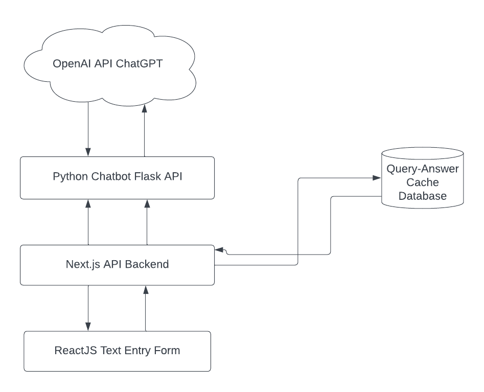

# Chatbot API 🤖✨

API for my AI Chatbot on my website. Includes Dockerized Python Flask server and Python Retrieval-Augmented Generation (RAG) library LlamaIndex.

👉 Live Demo can be found on my site [✨ here ✨](https://nickchubb.ca)

### What is Retrieval-Augmented Generation (RAG)?


Retrieval-augmented generation is a mix of two types of AI models.

1. **Retrieval-based models:** These fetch information from a database.

2. **Generative models:** These create new content.

In retrieval-augmented generation, a system combines both. It fetches relevant information from a database using a retrieval model and then uses a generative model to create responses. This helps in generating more accurate and meaningful content by using existing knowledge.


### Resources: 

- LlamaIndex: https://docs.llamaindex.ai/en/stable/index.html


## Features 🛠️



1. **Front-end Text Popup**

- 

2. **Python LlamaIndex Chatbot**

- 

3. **Flask Python Webserver -- Containerized**

- 

4. **Query-Answer Cache of Common Questions**

- I recognized I could decrease the number of necessary calls to the OpenAI API (thus, decreasing my fees and response time to a question) by implementing an PostgreSQL database of with two columns: a trimmed and lowercased input query as a key, which relates to a value that is the response received from OpenAI ChatGPT. Thus, creating a store of common questions and answers, so if a user asks a question which has been asked with the exact same wording as before, they will receive an answer quicker from this database than having to wait to query OpenAI.

## Challenges ❗️

Throughout the time I spent working on this project, I faced several architectural and implementational challenges.

### How to work with OpenAI and LlamaIndex?

### What LLMs to use? What generation settings?

To begin to familiarize myself with the 

### How to implement the backend?

Once I had my Python script completed, I began to realize running it in response to a form submission from the front-end would be more complicated than I thought. 

Initially, I had planned to run the Python scripts simply on vercel, like my portfolio site. However, this would not work for this project since the Vercel serverless functions cap out at 250mb of storage space, meanwhile the LlamaIndex index of my data was around 1.3gb--far too large. 

So, I was left trying to find another option than serverless functions. I recognzied Google Cloud Run would work as a CaaS (Container as a Service) platform which suits my needs, since it allowed enough memory to run the intensive RAG process.

### Using a database as a Query-Answer Cache to decrease OpenAI API calls:

I decided to use Supabase as my PostreSQL provider, since I am familiar with it from another project. I briefly considered working with a NoSQL database such as MongoDB (which I have worked with before), but I figured that since it was such a simple lookup key -> value lookup table, a simple SQL database would suffice. 

## Errors

Some errors I faced when I was developing this part of the app and how I solved them. (Mostly here for me)

```
ValueError: No API key found for OpenAI.
Please set either the OPENAI_API_KEY environment variable or openai.api_key prior to initialization.
API keys can be found or created at https://platform.openai.com/account/api-keys
```

fix: https://stackoverflow.com/questions/76771761/why-does-llama-index-still-require-an-openai-key-when-using-hugging-face-local-e

```
HTTP Request: POST https://api.openai.com/v1/embeddings "HTTP/1.1 429 Too Many Requests"
INFO:openai._base_client:Retrying request to /embeddings in 6.511309 seconds
Retrying request to /embeddings in 6.511309 seconds
```

explanation: Seems to be broken sometimes when using the storage persist, not too sure 

fix: 

```
RuntimeError: "LayerNormKernelImpl" not implemented for 'Half'
```

fix: model_kwargs={"torch_dtype": torch.float16} should not be set